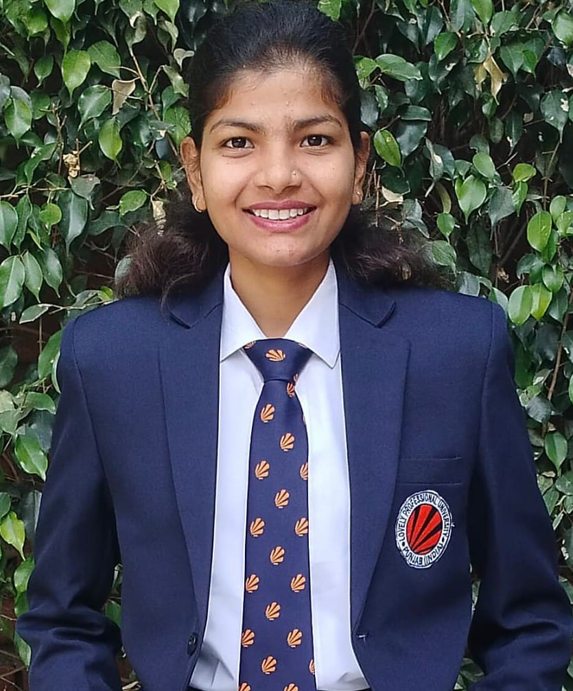

# Deepshikha Pal - Portfolio Website

## Overview
This is a personal portfolio website for Deepshikha Pal, a Full-Stack Developer and Computer Science student at Lovely Professional University. The website showcases her skills, projects, education, certifications, and work experience.

## Features
- Responsive design that works on all devices
- Clean, modern UI with gradient background
- Sections for:
  - About Me
  - Skills (with progress bars)
  - Projects (with live demos and GitHub links)
  - Resume
  - Work Experience
  - Certifications
  - Education
  - Conatct
- Smooth scrolling navigation
- Interactive elements and hover effects

## Technologies Used
- **Frontend**: HTML5, CSS3, JavaScript
- **Styling**: Inline CSS with modern design principles
- **Icons**: Font Awesome
- **Hosting**: (Can be deployed on Netlify, Vercel, GitHub Pages, etc.)

## Projects Showcased
1. **Travel Blog Website** - HTML, CSS, JavaScript
2. **The Home Decor** - React, Node.js, MongoDB, Express
3. **Learning Website** - HTML, CSS, JavaScript
4. **Online Food Ordering System** - React, Node.js, MongoDB, Express

## Installation
No installation required - this is a static website. Simply open the `index.html` file in any modern web browser.

## How to Use
1. Clone this repository
2. Open `index.html` in your browser
3. Navigate through the different sections using the menu

## Customization
To personalize this portfolio:
1. Replace `my_photo.jpeg` with your own photo
2. Update the text content in each section
3. Modify the skills and proficiency levels
4. Add/remove projects as needed
5. Update the certification PDFs in the `certificate` folder

## Live Demo
[[View Live Portfolio]https://deepshikha-pal-portfolio.netlify.app/](#) *(Add your live URL here when deployed)*

## License
This project is open source and available under the MIT License.

## Contact
- GitHub: [DEEPSHIKHA102](https://github.com/DEEPSHIKHA102)
- LinkedIn: [Deepshikha Pal](https://www.linkedin.com/in/deepshikha-pal-7915a5251/)
